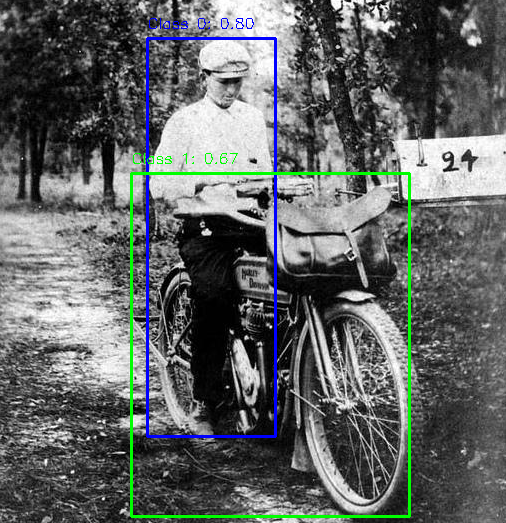
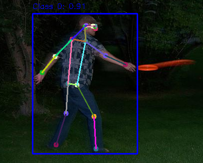
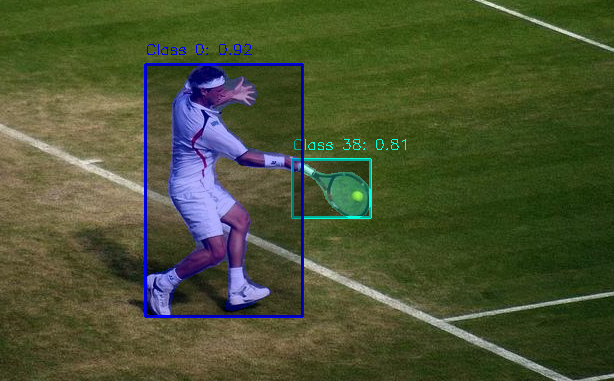
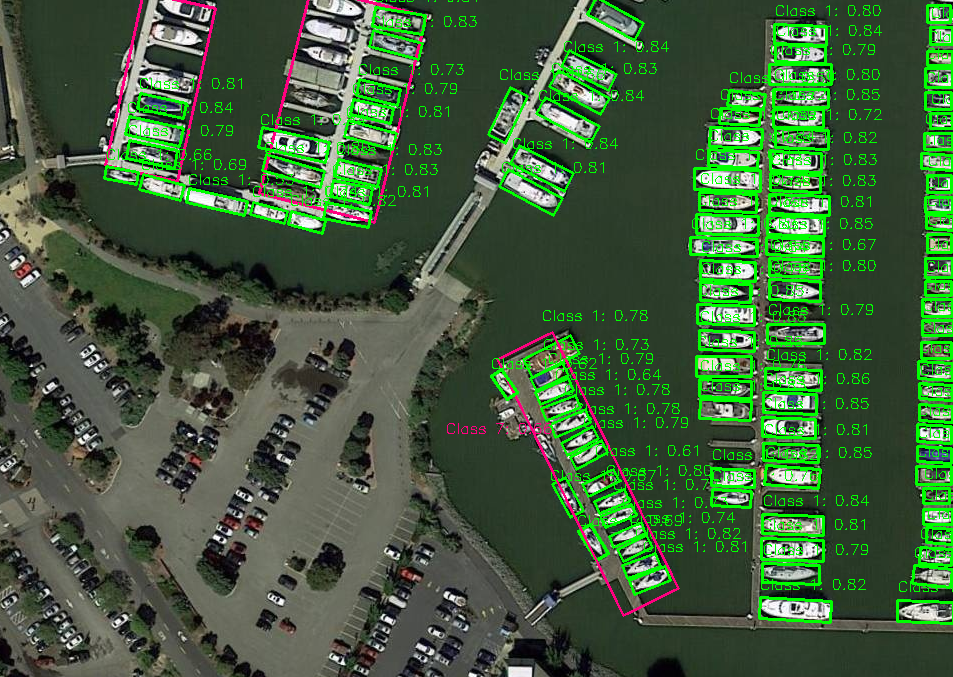

<p align="center">
  
</p>

<p align="center">
  <a href="https://github.com/nexlab-wang/InferX.git">
    
  </a>
  <a href="https://github.com/nexlab-wang/InferX.git">
    
  </a>
  <a>
    
  </a>
  <a href="https://github.com/nexlab-wang/InferX.git">
    
  </a>
</p>

💥InferX is a general-purpose high-performance AI inference tool designed to provide efficient inference capabilities in the field of computer vision. It supports multiple inference backends (such as TensorRT, OpenVINO) and provides implementations for widely used industrial models such as the full YOLO series and RT-DETR. InferX adopts a modular design, focusing on performance, flexibility, and ease of use, and is suitable for deployment scenarios on edge computing and servers.🚀

<p align="center">
  <table>
    <!-- First row for images -->
    <tr>
      <td align="center" width="20%">
        
      </td>
      <td align="center" width="20%">
        
      </td>
      <td align="center" width="20%">
        
      </td>
      <td align="center" width="20%">
        
      </td>
      <td align="center" width="20%">
        
      </td>
    </tr>
    <!-- Second row for names -->
    <tr>
      <td align="center">
        <strong>YOLO-Detection</strong>
      </td>
      <td align="center">
        <strong>YOLO-Pose</strong>
      </td>
      <td align="center">
        <strong>YOLO-Segment</strong>
      </td>
      <td align="center">
        <strong>YOLO-OBB</strong>
      </td>
      <td align="center">
        <strong>RT-DETR</strong>
      </td>
    </tr>
  </table>
</p>

### ✨ Main Features
✅ Multi-backend support: TensorRT, OpenVINO  
✅ Multi-model support: Full YOLO series (Detection/Pose/Segment/OBB), RT-DETR  
✅ High-performance preprocessing and postprocessing based on CUDA and CPU  
✅ Comprehensive logging and parameter parsing system  
✅ Cross-platform support (Windows/Linux), supports Docker deployment  
✅ Modular design, easy to expand  

## 1. 🛠️ System Architecture
The system adopts a layered modular design, isolating the inference engine and algorithm models, facilitating the expansion and secondary development of subsequent models and inference frameworks.🧩

<p align="center">
  
</p>

## 2. 📦 Installation Guide

### 2.1  🖥️ System Requirements
| Component | Requirement |
|------|------|
| Operating System | Ubuntu 18.04/20.04/22.04 or Windows 10/11 |
| GPU | NVIDIA GPU (supports CUDA 11.x) |
| CPU | x86_64 or ARM64 |
| Memory | ≥4GB |
| Disk Space | ≥1GB |

### 2.2 🌐 Dependencies
- **Basic Tools**:
  - CMake 3.12+
  - C++17 Compiler (GCC9+/Clang 10+/MSVC 2019+)
  
- **Main Libraries**:
  - OpenCV 4.5+
  - CUDA 11.x/12.x
  - TensorRT 10.x
  - OpenVINO 2022.x

### 2.3 🚀 Compilation and Installation

#### Linux System
```bash
git clone https://github.com/nexlab-wang/InferX.git 
cd inferx
mkdir build && cd build
cmake -D3rdParty_DIR=/path/to/3rdparty -DCMAKE_BUILD_TYPE=Release ..
make -j$(nproc)
```

#### Windows System
```powershell
git clone https://github.com/nexlab-wang/InferX.git 
cd inferx
cmake -B build -D3rdParty_DIR="path\to\3rdparty"
cmake --build build --config Release
```

#### Docker Deployment
```bash
docker pull nvidia/cuda:12.3.2-cudnn9-devel-ubuntu22.04
# Custom Image
docker build -t inferx:12.3.2 .
# Build Container
docker run --name inferx_docker -it --gpus all --cap-add=SYS_PTRACE --security-opt seccomp=unconfined -p 8080:8080 -v path/inferx:/workspace/inferx inferx:12.3.2 /bin/bash

# OpenCV Compilation
cd /workspace/3dparty/opencv_src_code
mkdir build && cd build
cmake -D CMAKE_BUILD_TYPE=RELEASE -D CMAKE_INSTALL_PREFIX=/workspace/3dparty/opencv ..
make -j4
make install
```

## 3. 📒 Usage Instructions

### 3.1 🪄 Basic Usage Flow
1. Initialize the InferX engine
2. Load the configuration file
3. Prepare input data
4. Execute inference
5. Process output results

### 3.2 Example Code
```cpp
#include <NexLab/InferX.h>

int main() {
    // Initialization
    NexLab::InferX inferx;

    std::string config_path = "path/inferx_config.json";

    if (!inferx.load_config(config_path)) {
        LOG_ERROR(NexLab::Logger::GetInstance(), "APP loading infex config is Failed.");
        return -1;
    }

    if (!inferx.init_dataset_stream()) {
        LOG_ERROR(NexLab::Logger::GetInstance(), " APP loading dataset is Failed.");
        return -1;
    }

    const int batch_size = 4;
    std::vector<cv::Mat> batch_frame;
    std::vector<cv::Scalar> colors;

    auto is_viewer = inferx.is_viewer();
    if (is_viewer)
        colors = NexLab::generate_class_colors(80);

    while (inferx.is_stream_open()) {
        batch_frame.clear();
        cv::Mat frame;

        for (int i = 0; i < batch_size && inferx.get_next_frame(frame); ++i) {
            batch_frame.emplace_back(frame.clone());
        }

        if (batch_frame.empty())
            break;

        std::vector<std::vector<NexLab::InferRes>> batch_result;
        if (inferx.model_infer(batch_frame, batch_result)) {
            if (is_viewer)
                NexLab::viewer(batch_frame, batch_result, colors);
        }
    }
}
```

### 3.3 Configuration Parameters Explanation
#### Main Configuration File of InferX (inferx_config.json)

```json
{
    "dataset_path": "Path to dataset",
    "dev_type": "Device type",
    "enable_visualization": "Whether to enable visualization",
    "infer_engine": "Inference engine",
    "model_path": "Path to model file", 
    "model_type": "Model type",
    "params_path": "Path to model-specific parameter configuration file"
}
```

**Parameter Details**:

| Parameter Name               | Type   | Optional Values                                                       | Description                               |
| ---------------------- | ------ | ------------------------------------------------------------ | ---------------------------------- |
| `dataset_path`         | string | -                                                            | Path to dataset                     |
| `dev_type`             | string | `DEV_GPU`, `DEV_CPU`, `DEV_NPU`, `DEV_GPU_CPU`               | Specifies the running device                       |
| `enable_visualization` | bool   | `true`, `false`                                              | Whether to display visualization results                 |
| `infer_engine`         | string | `TensorRT`, `OpenVINO`, `ONNXRuntime`, `LibTorch`, `OpenCV`  | Inference engine used                     |
| `model_path`           | string | -                                                            | Model file path (e.g., .trt/.onnx/.pt) |
| `model_type`           | string | `YOLO_DETECTION`, `YOLO_POSE`, `YOLO_SEGMENT`, `YOLO_OBB`, `RT_DETR`, `POINTNET`, `CUSTOM` | Model type                           |
| `params_path`          | string | -                                                            | Path to model-specific parameter configuration file           |

#### Model Parameter Configuration File (e.g., yolo_detection.json)

```json
{
    "model_type": "Model type",
    "batch_size": "Batch size",
    "dynamic_input": "Whether dynamic input",
    "model_input_names": ["Input node names"],
    "model_output_names": ["Output node names"],
    "class_names": ["Class names"],
    "dst_h": "Model input height",
    "dst_w": "Model input width",
    "src_h": "Original image height (0 means automatic)",
    "src_w": "Original image width (0 means automatic)", 
    "input_channels": "Number of input channels",
    "iou_threshold": "IoU threshold",
    "confidence_threshold": "Confidence threshold",
    "num_class": "Number of classes",
    "num_detection": "Number of detections",
    "mask_size": "Segmentation mask size",
    "num_mask": "Number of masks",
    "num_pose": "Number of keypoints"
}
```

**Parameter Details**:

| Parameter Name               | Type   | Example Value              | Description                       |
| ---------------------- | ------ | ------------------- | -------------------------- |
| `model_type`           | string | `YOLO_DETECTION`    | Consistent with main configuration               |
| `batch_size`           | int    | `4`                 | Batch size                 |
| `dynamic_input`        | bool   | `true`              | Whether to support dynamic input size       |
| `model_input_names`    | array  | `["images"]`        | Model input node names           |
| `model_output_names`   | array  | `["output0"]`       | Model output node names           |
| `class_names`          | array  | `["person", "car"]` | List of class names               |
| `dst_h`                | int    | `640`               | Model input height               |
| `dst_w`                | int    | `640`               | Model input width               |
| `src_h`                | int    | `0`                 | Original image height (0 means automatic)    |
| `src_w`                | int    | `0`                 | Original image width (0 means automatic)    |
| `input_channels`       | int    | `3`                 | Number of input image channels             |
| `iou_threshold`        | float  | `0.5`               | NMS IoU threshold                |
| `confidence_threshold` | float  | `0.5`               | Detection confidence threshold             |
| `num_class`            | int    | `80`                | Number of classes                   |
| `num_detection`        | int    | `8400`              | Predefined number of detection boxes           |
| `mask_size`            | int    | `0`                 | Segmentation mask size (for segmentation models) |
| `num_mask`             | int    | `0`                 | Number of masks (for segmentation models)     |
| `num_pose`             | int    | `0`                 | Number of keypoints (for pose models)   |

## 4. 📆 Future Plans
- [ ] Support more model architectures
- [ ] Add Huawei Ascend/RK3588 support
- [ ] Optimize memory management
- [ ] Distributed inference support
- [ ] Python interface development

## 5. Contributing
Contributions are welcome! Follow the steps below:🤝
1. Fork this repository
2. Create a feature branch (`git checkout -b feature/xxx`)
3. Commit your changes (`git commit -m 'Add some feature'`)
4. Push to the branch (`git push origin feature/xxx`)
5. Create a Pull Request

## 6. FAQs

### ❓ Model Conversion Issues

**Q: How to convert a PT model to ONNX?**

- See the conversion tools provided in tools

**Q: How to convert an ONNX model to TensorRT?**

```bash
trtexec --onnx=model.onnx --saveEngine=model.engine --fp16

## For multi-batch model conversion
trtexec.exe --onnx=model.onnx --saveEngine=model.engine --minShapes=images:1x3x640x640 --optShapes=images:4x3x640x640 --maxShapes=images:16x3x640x640 --fp16 --verbose
```

**Q: How to convert an ONNX model to OpenVINO?**
Make sure to include the following library files:

- Set up the OpenVINO virtual environment

  ~~~bash
  pip install openvino -i https://mirrors.aliyun.com/pypi/simple
  ~~~

  

- Use the onnx2openvino.ipynb tool for model conversion

### ❓ Compilation Issues
**Q: CMake cannot find dependencies?**
Check if the `3rdParty_DIR` path is correctly set:
```bash
cmake -D3rdParty_DIR=/absolute/path/to/3rdparty ..
```

---

<p align="center">
  <table>
    <tr>
      <td align="center" width="50%">
        <h3>Contact Us</h3>
        <p>
          <b>📧 Email: </b> wang740214770@163.com<br>
          <b>🐛 Issue Reporting: </b> <a href="https://github.com/nexlab/inferx/issues">GitHub Issues</a>
        </p>
      </td>
      <td align="center" width="50%">
        <h3>Follow NexLab</h3>
        
        <p>Stay updated with the latest technical news</p>
      </td>
    </tr>
  </table>
</p>
```