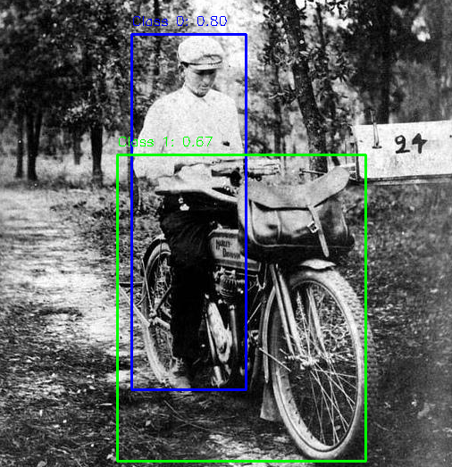
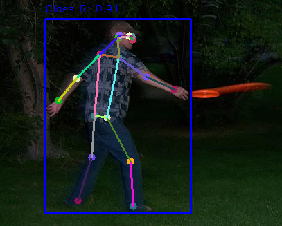
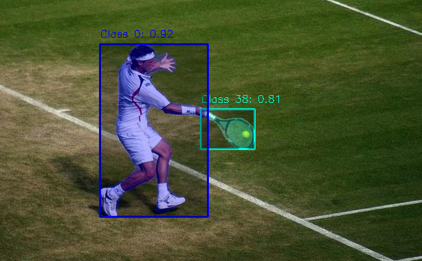
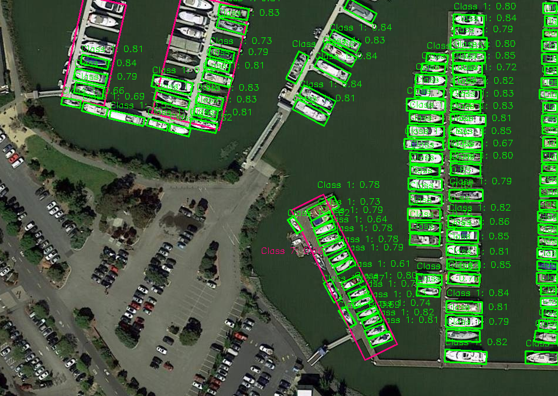
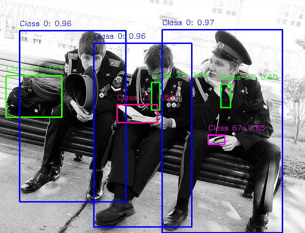

<p align="center">
  <a href="README.en.md">English</a> | <a href="README.md">中文</a>
</p>
<p align="center">
  
</p>
<p align="center">
  <a href="https://github.com/nexlab-wang/InferX.git">
    
  </a>
  <a href="https://github.com/nexlab-wang/InferX.git">
    
  </a>
  <a>
    
  </a>
  <a href="https://github.com/nexlab-wang/InferX.git">
    
  </a>
</p>

💥InferX是一款通用高性能AI推理工具，旨在为计算机视觉领域提供高效的推理能力。支持多种推理后端(如TensorRT、OpenVINO)，并提供了YOLO全系列和RT-DETR等工业应用广泛模型的实现。InferX采用模块化设计，注重性能、灵活性和易用性，适用于边缘计算和服务器部署场景。🚀
<p align="center">
  <table>
    <!-- First row for images -->
    <tr>
      <td align="center" width="20%">
        
      </td>
      <td align="center" width="20%">
        
      </td>
      <td align="center" width="20%">
        
      </td>
      <td align="center" width="20%">
        
      </td>
      <td align="center" width="20%">
        
      </td>
    </tr>
    <!-- Second row for names -->
    <tr>
      <td align="center">
        <strong>YOLO-Detection</strong>
      </td>
      <td align="center">
        <strong>YOLO-Pose</strong>
      </td>
      <td align="center">
        <strong>YOLO-Segment</strong>
      </td>
      <td align="center">
        <strong>YOLO-OBB</strong>
      </td>
      <td align="center">
        <strong>RT-DETR</strong>
      </td>
    </tr>
  </table>
</p>

### ✨主要特性
✅ 多后端支持：TensorRT、OpenVINO  
✅ 多模型支持：YOLO全系列(Detection/Pose/Segment/OBB)、RT-DETR  
✅ 基于CUDA和CPU的不同版本高性能预处理和后处理  
✅ 完善的日志和参数解析系统  
✅ 跨平台支持(Windows/Linux)，支持Docker部署  
✅ 模块化设计，易于扩展  

## 1. 🛠️系统架构
系统采用分层模块化设计，将推理引擎和算法模型隔离，便于后续模型和推理框架的扩展和二次开发。🧩

<p align="center">
  
</p>

## 2. 📦安装指南

### 2.1  🖥️系统要求
| 组件 | 要求 |
|------|------|
| 操作系统 | Ubuntu 18.04/20.04/22.04 或 Windows 10/11 |
| GPU | NVIDIA GPU (支持CUDA 11.x) |
| CPU | x86_64 或 ARM64 |
| 内存 | ≥4GB |
| 磁盘空间 | ≥1GB |

### 2.2 🌐依赖项
- **基础工具**:
  - CMake 3.12+
  - C++17编译器 (GCC9+/Clang 10+/MSVC 2019+)
  
- **主要库**:
  - OpenCV 4.5+
  - CUDA 11.x/12.x
  - TensorRT 10.x
  - OpenVINO 2022.x

### 2.3 🚀编译安装

#### Linux系统
```bash
git clone https://github.com/nexlab-wang/InferX.git
cd inferx
mkdir build && cd build
cmake -D3rdParty_DIR=/path/to/3rdparty -DCMAKE_BUILD_TYPE=Release ..
make -j$(nproc)
```

#### Windows系统
```powershell
git clone https://github.com/nexlab-wang/InferX.git
cd inferx
cmake -B build -D3rdParty_DIR="path\to\3rdparty"
cmake --build build --config Release
```

#### Docker部署
```bash
docker pull nvidia/cuda:12.3.2-cudnn9-devel-ubuntu22.04
#自定义镜像
docker build -t inferx:12.3.2 .
#构建容器
docker run --name inferx_docker -it --gpus all --cap-add=SYS_PTRACE --security-opt seccomp=unconfined -p 8080:8080 -v path/inferx:/workspace/inferx inferx:12.3.2 /bin/bash

#opencv编译
cd /workspace/3dparty/opencv_src_code
mkdir build && cd build
cmake -D CMAKE_BUILD_TYPE=RELEASE -D CMAKE_INSTALL_PREFIX=/workspace/3dparty/opencv ..
make -j4
make install
```

## 3. 📒使用说明

### 3.1 🪄基本使用流程
1. 初始化InferX引擎
2. 加载配置文件
3. 准备输入数据
4. 执行推理
5. 处理输出结果

### 3.2 示例代码
```cpp
#include <NexLab/InferX.h>

int main() {
    // 初始化
    NexLab::InferX inferx;

    std::string config_path = "path/inferx_config.json";

    if (!inferx.load_config(config_path)) {
        LOG_ERROR(NexLab::Logger::GetInstance(), "APP loading infex config is Failed.");
        return -1;
    }

    if (!inferx.init_dataset_stream()) {
        LOG_ERROR(NexLab::Logger::GetInstance(), " APP loading dataset is Failed.");
        return -1;
    }

    const int batch_size = 4;
    std::vector<cv::Mat> batch_frame;
    std::vector<cv::Scalar> colors;

    auto is_viewer = inferx.is_viewer();
    if (is_viewer)
        colors = NexLab::generate_class_colors(80);

    while (inferx.is_stream_open()) {
        batch_frame.clear();
        cv::Mat frame;

        for (int i = 0; i < batch_size && inferx.get_next_frame(frame); ++i) {
            batch_frame.emplace_back(frame.clone());
        }

        if (batch_frame.empty())
            break;

        std::vector<std::vector<NexLab::InferRes>> batch_result;
        if (inferx.model_infer(batch_frame, batch_result)) {
            if (is_viewer)
                NexLab::viewer(batch_frame, batch_result, colors);
        }
    }
}
```

### 3.3 配置参数说明
#### InferX 主配置文件 (inferx_config.json)

```json
{
    "dataset_path": "数据集路径",
    "dev_type": "设备类型",
    "enable_visualization": "是否启用可视化",
    "infer_engine": "推理引擎",
    "model_path": "模型文件路径", 
    "model_type": "模型类型",
    "params_path": "模型参数配置文件路径"
}
```

**参数详解**:

| 参数名称               | 类型   | 可选值                                                       | 说明                               |
| ---------------------- | ------ | ------------------------------------------------------------ | ---------------------------------- |
| `dataset_path`         | string | -                                                            | 数据集存放路径                     |
| `dev_type`             | string | `DEV_GPU`, `DEV_CPU`, `DEV_NPU`, `DEV_GPU_CPU`               | 指定运行设备                       |
| `enable_visualization` | bool   | `true`, `false`                                              | 是否显示可视化结果                 |
| `infer_engine`         | string | `TensorRT`, `OpenVINO`, `ONNXRuntime`, `LibTorch`, `OpenCV`  | 使用的推理引擎                     |
| `model_path`           | string | -                                                            | 模型文件路径（如.trt/.onnx/.pt等） |
| `model_type`           | string | `YOLO_DETECTION`, `YOLO_POSE`, `YOLO_SEGMENT`, `YOLO_OBB`, `RT_DETR`, `POINTNET`, `CUSTOM` | 模型类型                           |
| `params_path`          | string | -                                                            | 模型专用参数配置文件路径           |

#### 模型参数配置文件 (如yolo_detection.json)

```json
{
    "model_type": "模型类型",
    "batch_size": "批处理大小",
    "dynamic_input": "是否动态输入",
    "model_input_names": ["输入节点名称"],
    "model_output_names": ["输出节点名称"],
    "class_names": ["类别名称"],
    "dst_h": "模型输入高度",
    "dst_w": "模型输入宽度",
    "src_h": "原始图像高度(0表示自动)",
    "src_w": "原始图像宽度(0表示自动)", 
    "input_channels": "输入通道数",
    "iou_threshold": "IoU阈值",
    "confidence_threshold": "置信度阈值",
    "num_class": "类别数量",
    "num_detection": "检测框数量",
    "mask_size": "分割掩码尺寸",
    "num_mask": "掩码数量",
    "num_pose": "关键点数量"
}
```

**参数详解**:

| 参数名称               | 类型   | 示例值              | 说明                       |
| ---------------------- | ------ | ------------------- | -------------------------- |
| `model_type`           | string | `YOLO_DETECTION`    | 与主配置一致               |
| `batch_size`           | int    | `4`                 | 批处理大小                 |
| `dynamic_input`        | bool   | `true`              | 是否支持动态输入尺寸       |
| `model_input_names`    | array  | `["images"]`        | 模型输入节点名称           |
| `model_output_names`   | array  | `["output0"]`       | 模型输出节点名称           |
| `class_names`          | array  | `["person", "car"]` | 类别名称列表               |
| `dst_h`                | int    | `640`               | 模型输入高度               |
| `dst_w`                | int    | `640`               | 模型输入宽度               |
| `src_h`                | int    | `0`                 | 原始图像高度(0表示自动)    |
| `src_w`                | int    | `0`                 | 原始图像宽度(0表示自动)    |
| `input_channels`       | int    | `3`                 | 输入图像通道数             |
| `iou_threshold`        | float  | `0.5`               | NMS IoU阈值                |
| `confidence_threshold` | float  | `0.5`               | 检测置信度阈值             |
| `num_class`            | int    | `80`                | 类别数量                   |
| `num_detection`        | int    | `8400`              | 预定义检测框数量           |
| `mask_size`            | int    | `0`                 | 分割掩码尺寸(分割模型使用) |
| `num_mask`             | int    | `0`                 | 掩码数量(分割模型使用)     |
| `num_pose`             | int    | `0`                 | 关键点数量(姿态模型使用)   |

## 4. 📆未来计划
- [ ] 支持更多模型架构
- [ ] 增加华为升腾/RK3588支持
- [ ] 优化内存管理
- [ ] 分布式推理支持
- [ ] Python接口开发

## 5. 参与贡献
欢迎贡献代码！流程如下：🤝
1. Fork本仓库
2. 创建特性分支 (`git checkout -b feature/xxx`)
3. 提交更改 (`git commit -m 'Add some feature'`)
4. 推送到分支 (`git push origin feature/xxx`)
5. 创建Pull Request

## 6. 常见问题

### ❓ 模型转换问题

**Q: 如何转换PT模型到ONNX?**

- 详见tools中提供的转换工具

**Q: 如何转换ONNX模型到TensorRT?**

```bash
trtexec --onnx=model.onnx --saveEngine=model.engine --fp16

##多batch模型转换
trtexec.exe --onnx=model.onnx --saveEngine=model.engine --minShapes=images:1x3x640x640 --optShapes=images:4x3x640x640 --maxShapes=images:16x3x640x640 --fp16 --verbose
```

**Q: 如何转换ONNX模型到OpenVINO?**
请确保包含以下库文件：

- 按照OpenVINO虚拟环境

  ~~~bash
  pip install openvino -i https://mirrors.aliyun.com/pypi/simple
  ~~~

  

- 使用onnx2openvino.ipynb工具进行模型转换

### ❓ 编译问题
**Q: CMake找不到依赖项?**
检查`3rdParty_DIR`路径是否正确设置：
```bash
cmake -D3rdParty_DIR=/absolute/path/to/3rdparty ..
```

---

<p align="center">
  <table>
    <tr>
      <td align="center" width="50%">
        <h3>联系我们</h3>
        <p>
          <b>📧 邮箱: </b> wang740214770@163.com<br>
          <b>🐛 问题反馈: </b> <a href="https://github.com/nexlab/inferx/issues">GitHub Issues</a>
        </p>
      </td>
      <td align="center" width="50%">
        <h3>关注NexLab公众号</h3>
        
        <p>获取最新技术动态</p>
      </td>
    </tr>
  </table>
</p>
